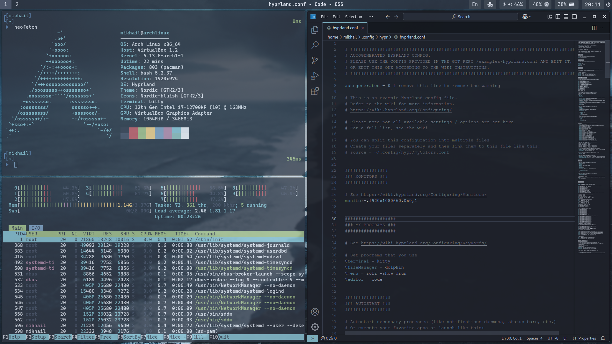
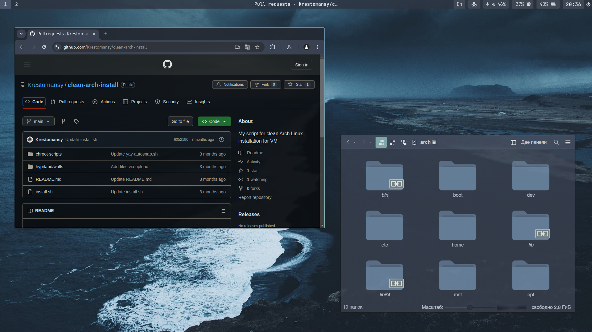
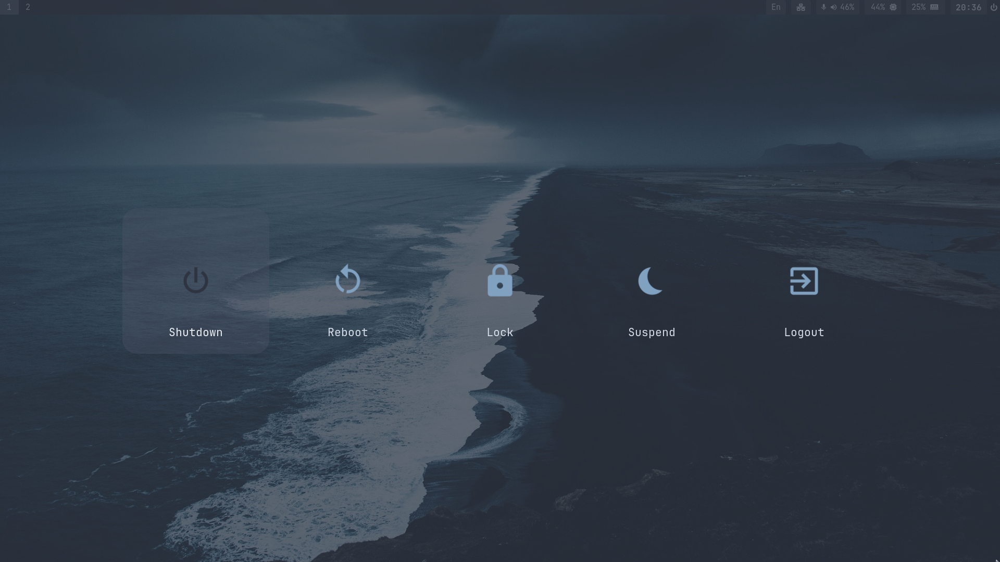

# Hyprland Nord dotfiles


## Overview and installation
This is my custom config files for Arch based Hyprland setup using Nord theme. 

Installation is manual. Before installation, you need to install Arch with needed graphic drivers (for Nvidia see below). Then clone this repository, manually install all packages and copy config files to folders. 

## Needed packages
```
sudo pacman -S hyprland kitty dolphin dolphin-plugins kia-admin code firefox rofi-wayland pavucontrol waybar chromium qt5ct qt6ct qt5-wayland qt6-wayland kvantum kvantum-qt5 cliphist xdg-desktop-portal-hyprland xwaylandvideobridge xorg-xwayland archlinux-xdg-menu sddm xorg nwg-look ark nm-connection-editor libnotify dunst pipewire wireplumber pipewire-pulse hyprpolkitagent unzip playerctl uwsm hyprpaper hyprlock

yay -S oh-my-posh hyprshot hyprcursors Nordzy-cursors Nordzy-hyprcursors wlogout xwaylandvideobridge
```

## Nvidia

For detailed explanation see [Hyprland wiki](https://wiki.hyprland.org/Nvidia/) on this topic.

```
sudo pacman -S nvidia-open-dkms nvidia-utils lib32-nvidia-utils egl-wayland nvidia-settings
```

In `~/.config/hypr/hyprland.conf` add environmental variables:
```
env = LIBVA_DRIVER_NAME,nvidia
env = __GLX_VENDOR_LIBRARY_NAME,nvidia
env = ELECTRON_OZONE_PLATFORM_HINT,auto
```

In `/etc/mkinitcpio.conf` add to modules:
```
MODULES=(... nvidia nvidia_modeset nvidia_uvm nvidia_drm ...)
```

After that run `sudo mkinitcpio -P` and reboot


## Fonts
```
yay -S ttf-font-awesome ttf-cascadia-code-nerd ttf-jetbrains-mono-nerd
```

## SDDM
Enabling:
`systemctl enable sddm`

Creating autologin in SDDM:
Change in /usr/lib/sddm/sddm.conf.d/default.conf `Session=` to `Session=hyprland-uwsm` and `User=` to `User=USER_NAME`


## Folders and files to copy
Copy config files from repository to these locations:
- ~/.themes
- ~/.config/dolphinrc
- ~/.config/gwenviewrc
- ~/.config/kdeglobals
- ~/.config/dunst/.
- ~/.config/oh-my-posh/.
- ~/.config/hypr/.
- ~/.config/wlogout/.
- ~/.config/waybar/.
- ~/.config/Kvantum/.
- ~/.config/kitty/.
- ~/.config/rofi/.
- ~/.bashrc
- /etc/bash.bashrc

## Changing themes and icons in dolphin
1. Nord theme folder: copy to /usr/share/themes
2. Nord icons folder: copy existing breeze folder from /usr/share/icons to the same folder with different name -> сopy icons to this folder replacing files -> add theme to ~/.config/kdeglobals

## Enabling oh-my-posh config 
*(it is already done in provided .bashrc and bash.bashrc files, you only need to change to your username in bash.bashrc file)*
```
echo "eval \"\$(oh-my-posh init bash --config ~/.config/oh-my-posh/nordtron.omp.json\"" >> ~/.bashrc
echo "eval \"\$(oh-my-posh init bash --config home/${username}/.config/oh-my-posh/nordtron-root.omp.json\"" >> /etc/bash.bashrc
```

## Screenshots



## Links

- [Hyprland repository](https://github.com/hyprwm/Hyprland)
- [Nord theme official site](https://www.nordtheme.com/)
- [Nordic wallpapers](https://github.com/linuxdotexe/nordic-wallpapers)
- [Waybar is based on this config](https://github.com/Mjoyufull/old-hyprland-with-waybar-nord)
- [Rofi is based on this config](https://github.com/edr3x/.dotfiles)
- [My custom script for clean Arch install](https://github.com/Krestomansy/clean-arch-install)
